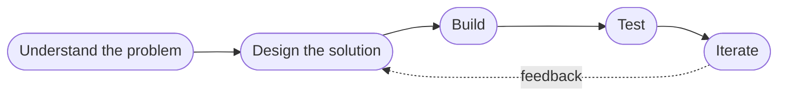

<!-- Repo name must be exactly your username: github.com/heyaftab/heyaftab  ·  keep assets/profile.jpg next to this file -->

 

---

## 👨‍💻 About Me

I'm a **Computer Science & Engineering student at United International University**, focused on building practical software, exploring AI and intelligent systems, and turning ideas into products people actually use.

I like working across the whole stack: interfaces and APIs, databases, automation and AI-powered applications.

> 💡 I'm most interested in problems where **software, data and intelligent systems meet the real world.**

---

## 🧠 Working Toward AI Engineering

<table>
<tr>
<td width="50%" valign="top">

**🤖 AI & Machine Learning**
Learning the fundamentals of intelligent systems

**🐍 Python**
My main language for backend and AI work

**🧩 Data Structures & Algorithms**
Problem-solving and clean, efficient code

</td>
<td width="50%" valign="top">

**⚙️ Backend & APIs**
FastAPI, Laravel and REST design

**🌐 Full-Stack Development**
React, Next.js and relational databases

**☁️ Cloud & Dev Tools**
Docker, Linux, Git and deployment workflows

</td>
</tr>
</table>

---

## 🚀 Currently Building

<table>
<tr>
<td width="50%" valign="top">

### 🏥 National Healthcare Record Exchange
A centralized platform that connects healthcare information through a structured digital system, with authentication, clinical records, notifications and role-based workflows.

`PHP` `MySQL` `JavaScript` `HTML/CSS`

</td>
<td width="50%" valign="top">

### 💎 Goynar Gontobbo
A full-stack jewellery e-commerce platform for a real-world business, with a structured product catalog and separate customer and admin workflows.

`Next.js` `TypeScript` `Tailwind` `Laravel` `MySQL`

</td>
</tr>
</table>

---

## 🛠️ Tech Stack

| | |
|---|---|
| **Languages** |  |
| **AI & Backend** |  |
| **Frontend** |  |
| **Databases** |  |
| **Tools & Cloud** |  |

---

## ⭐ Featured Projects

| Project | What it is | Highlights |
|---|---|---|
| 🏥 **NHRE** | Healthcare record exchange platform | Role-based workflows, clinical records, built to scale toward SQL Server |
| 💎 **Goynar Gontobbo** | Real-world jewellery e-commerce platform | Variant-rich catalog, Laravel API, customer + admin flows |
| 🎓 **UIU CSE Course Planner** | Academic planning and course management web app | Curriculum planning for UIU CSE students |
| 🖊️ **Smart CNC Plotter** | Microcontroller-based hardware + software project | Motor control, hardware interfacing, team build |
| 🏆 **12-Hour Hackathon** | Team build under a strict deadline | **3rd place** |

---

## ⚙️ How I Build

---

## 📊 GitHub Stats

---

## 📫 Let's Connect

Open to **AI / ML internships, junior roles and collaborations**, especially where Python and intelligent systems meet real products.

📧 [aftabuddinahmad26@gmail.com](mailto:aftabuddinahmad26@gmail.com) · 💼 [LinkedIn](https://linkedin.com/in/aftab-uddin-ahmad-7b3034294) · 🌐 [Portfolio](https://hey-aftab.lovable.app)

